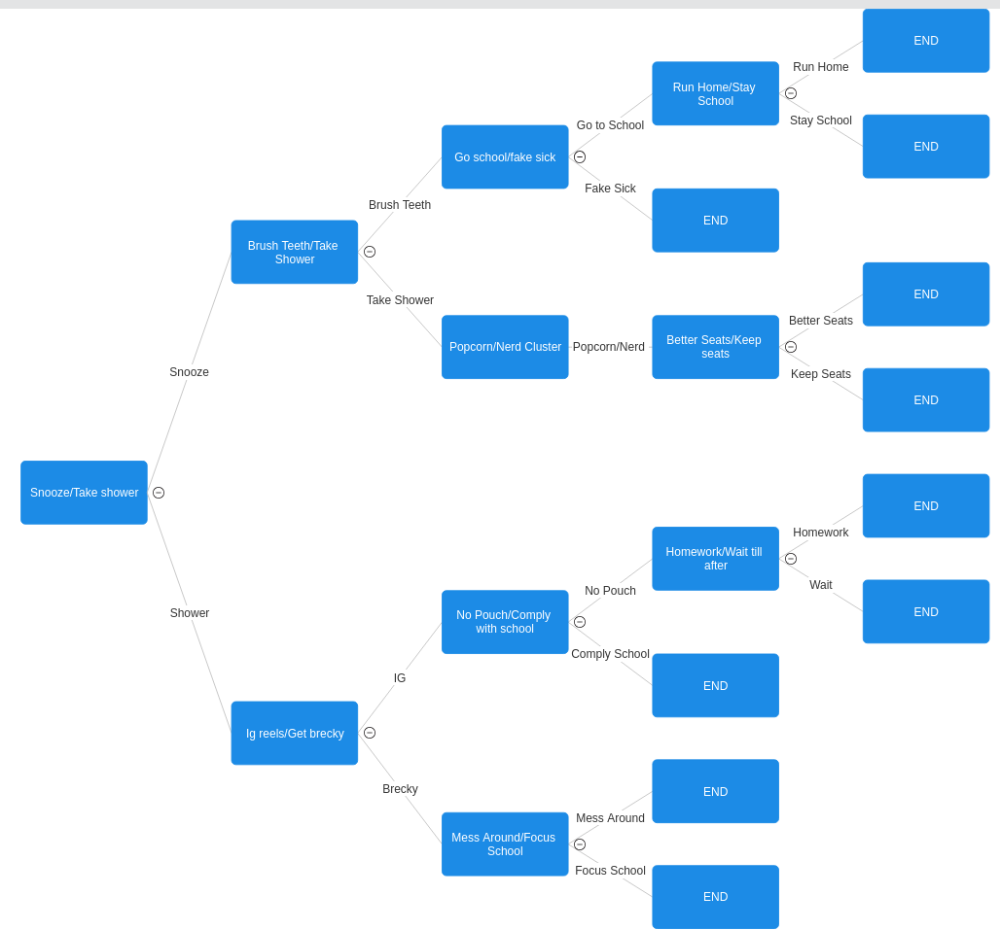

# Life Decision Simulator
This simulator will take you through the most important of life decisions

## Requirements
* Python 3.0 or better
* An environment to run in
* Time Library

## Installation
``` git clone https://github.com/WTCSC/life-decision-simulator-ianbarto-cs ```  
```python3 decision_tree.py```  

## Gameplay Examples  

Good morning my fine sir, I am your butler Timmy, lets get you ready for school!  
The day is April 1st 2020, it is 7:23 and you have school at 8  
  
Would you like to [1] Snoozeeeee or [2] Get you fat ahh out of bed: 1  
Of course you choose to sleep in, you have 10 minutes  
Zzzzzzzzzzzzzzzz  
...  
You finally need to get out of bed and get your school day started:  
Would you like to [1] Brush your teeth or [2] Take a shower: 2  
This shower feels like heaven, you sing to Katy Perry and everything  
Even your mom feels the mood and lets you skip school to go to the movies 🎬  

## Gameplay Flow Chart

  